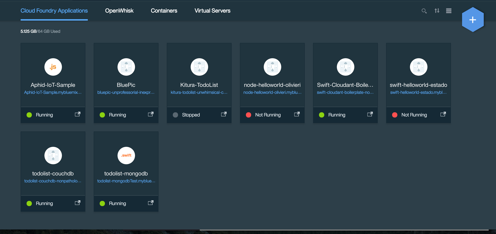
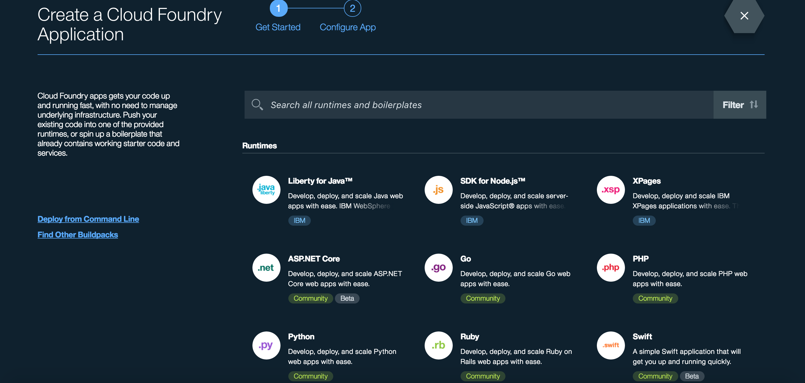
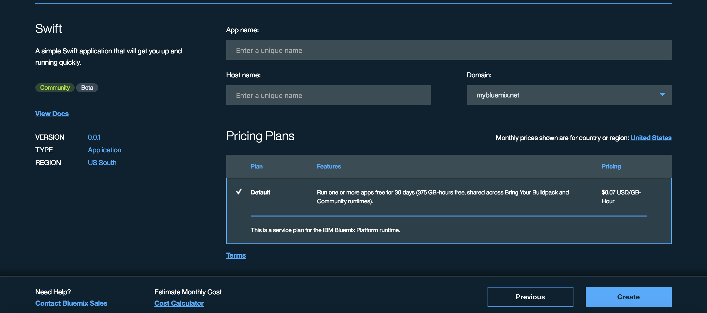
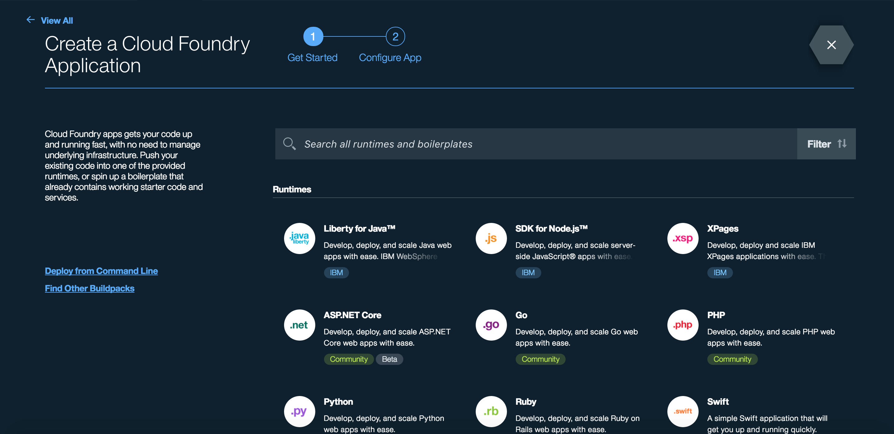
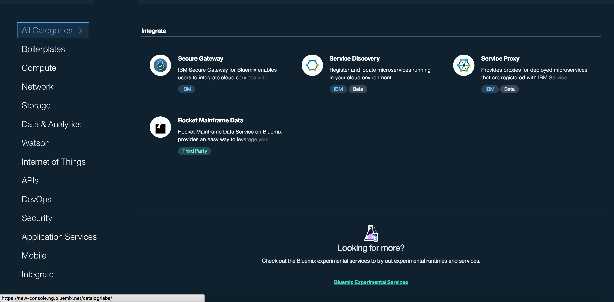
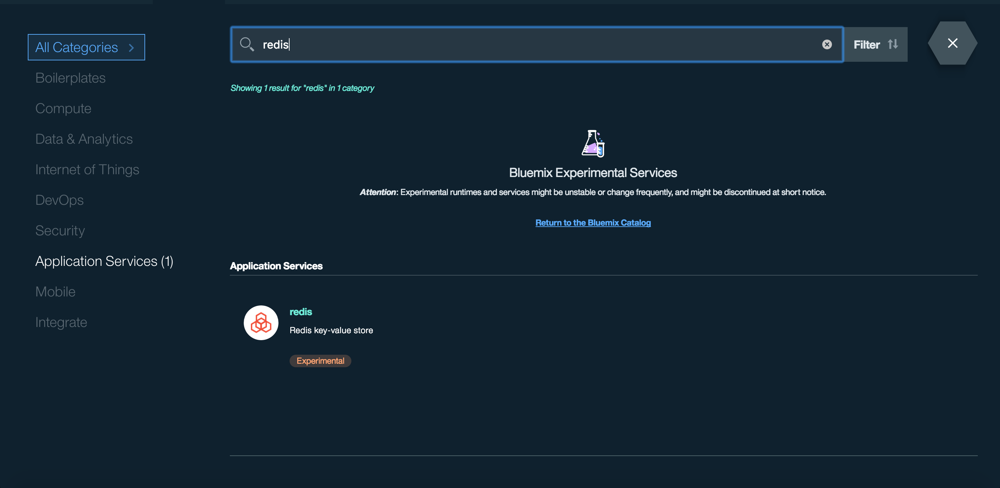
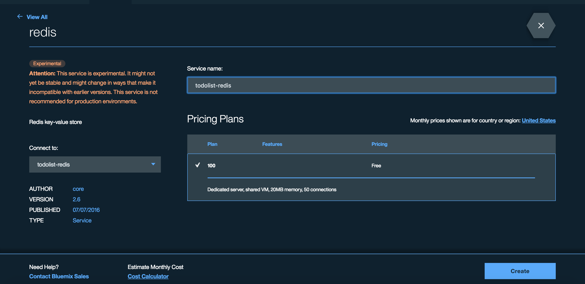
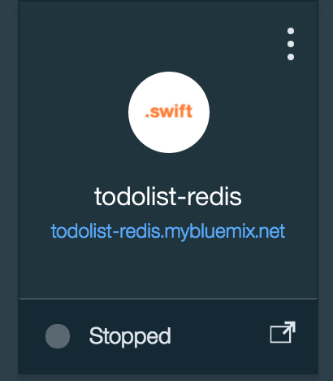

# TodoList Redis

[](https://travis-ci.org/IBM-Swift/TodoList-Redis)  [](https://swift.org/download/#snapshots)

Implements the [TodoListAPI](https://github.com/IBM-Swift/todolist-api) for TodoList. Uses the [Kitura-Redis](https://github.com/IBM-Swift/todolist-api) library for interfacing with Redis.

##Quick start:

1. Download the [Swift DEVELOPMENT 06-20 snapshot](https://swift.org/download/#snapshots)

2. Download redis
  You can use `brew install redis` or `apt-get install redis-server`

3. Clone the TodoList Redis repository
  `git clone https://github.com/IBM-Swift/todolist-redis`

4. Fetch the test cases by running:
  `git clone https://github.com/IBM-Swift/todolist-tests Tests`

5. Compile the library with `swift build` or create an XCode project with `swift package generate-xcodeproj`

6. Run the test cases with `swift test` or directly from XCode

##Setting up Swift application in Bluemix

1. Get an account for [Bluemix](https://new-console.ng.bluemix.net/?direct=classic) and go to Category called Compute

    

2. Then click the blue hexagon '+' icon on the top right corner

    

3. Look under the category of "Runtime" and click "Swift application"

    

4. Enter the app name as: todolist-redis and then create the application

    

##Setting up Redis service in Bluemix

1. Go to Bluemix homepage and click on the Category called Compute

    

2. Then click the blue hexagon '+' icon on the top right corner

    

3. Click "View all" on the top left corner, so it will show all categories

    

4. Scroll all the way down to look for [Bluemix Experimental Services](https://new-console.ng.bluemix.net/catalog/labs/)

    

5. Then search for "redis"

    

6. Create a redis service and connect the redis service to the Swift application that was created "todolist-redis"

    

7. Upon creation, you should see your unbound service on the dashboard page

    

##Deploying to Bluemix:

1. Dowload and install the Cloud Foundry tools:

  ```
  cf login
  bluemix api https://api.ng.bluemix.net
  bluemix login -u username -o org_name -s space_name
  ```

  ```
  Be sure to change the directory to the todolist-redis directory where the manifest.yml file is located.
  ```

2. Run ```cf push```

3. It should take several minutes, roughly 4-6 minutes. If it works correctly, it should state

  ```
  2 of 2 instances running
  App started
  ```
